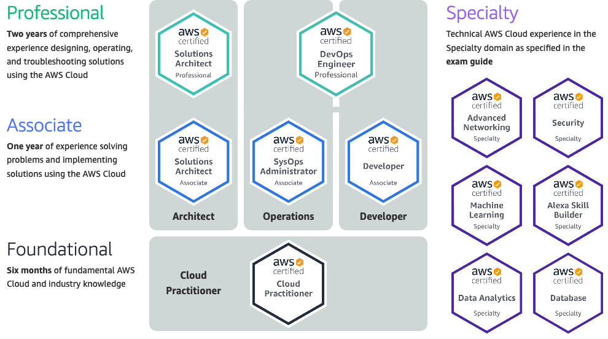

# AWS Developer Associate certification



## Description

**This repository contains resources from my work on the [AWS Developer Associate certification](https://aws.amazon.com/certification/certified-developer-associate/). It's mostly notes right now, but after I pass the exam, I will add more code examples.**

Potential exam questions are indicated with _(potential exam question)_. Unanswered questions about the material are indicated with _TODO:_.

I created the repository with the [GitHub CLI](https://cli.github.com/):

```sh
~/dev/aws
❯ gh repo create awsdev -d "AWS Developer Associate Certification" \
  --enable-issues=false --enable-wiki=false --public
```

```text
✓ Created repository br3ndonland/awsdev on GitHub
? Create a local project directory for br3ndonland/awsdev? Yes
✓ Initialized repository in './awsdev/'
```

## Resources

### Certifications

- [AWS certifications](https://aws.amazon.com/certification/)
- [freeCodeCamp: Pass the AWS Developer Associate exam with this free 16-hour course](https://www.freecodecamp.org/news/pass-the-aws-developer-associate-exam-with-this-free-16-hour-course/)
  - [Video 1](https://youtu.be/RrKRN9zRBWs) on YouTube
  - [Video 2](https://youtu.be/eCopK1RoyFM) on YouTube
  - If you would like to watch the videos offline, see [youtube-dl](https://github.com/ytdl-org/youtube-dl).
  - [Code](https://github.com/examproco/thefreeawsdeveloperassociate)

### General

- [AWS docs home](https://docs.aws.amazon.com/index.html)
- AWS What the Cloud _(recommended in the freeCodeCamp article)_
  - [YouTube](https://www.youtube.com/whatthecloud)
- Bart Castle _(recommended in the freeCodeCamp article)_
  - [YouTube](https://www.youtube.com/bartcastle)
  - [CBT Nuggets courses](https://www.cbtnuggets.com/trainers/bart-castle)

### IAM

- [Bart Castle IAM playlist](https://www.youtube.com/watch?v=jHQiX7QbLfA&list=PL3GN5xkPjwo23bCqxjxh0uXVW9tgIfhOi)
- [New IAM course](https://aws.amazon.com/about-aws/whats-new/2020/05/new-digital-course-on-aws-security-identity-and-compliance-now-available/) "[Getting Started with AWS Security, Identity, and Compliance](https://www.aws.training/Details/eLearning?id=49720)"

### DynamoDB

- [AWS DynamoDB docs](https://docs.aws.amazon.com/dynamodb/)
- [AWS CLI v2 docs: DynamoDB](https://awscli.amazonaws.com/v2/documentation/api/latest/reference/dynamodb/index.html#cli-aws-dynamodb)
- [AWS Boto3 v1 docs: DynamoDB](https://boto3.amazonaws.com/v1/documentation/api/latest/guide/dynamodb.html) - Boto3 is the Python SDK (Software Development Kit)
- Alex DeBrie
  - [Full Stack Radio podcast episode 2020 139](https://www.fullstackradio.com/episodes/139) 20200508
  - [DynamoDB Guide from Alex DeBrie](https://www.dynamodbguide.com)
  - AWS reinvent 2019: [Data modeling with Amazon DynamoDB](https://youtu.be/DIQVJqiSUkE), Alex DeBrie

### CloudFormation and infrastructure as code

- [Wikipedia: Infrastructure as code](https://en.wikipedia.org/wiki/Infrastructure_as_code)
- [AWS CloudFormation docs](https://docs.aws.amazon.com/cloudformation/index.html)
- [AWS CloudFormation docs: How does AWS CloudFormation work?](https://docs.aws.amazon.com/AWSCloudFormation/latest/UserGuide/cfn-whatis-howdoesitwork.html)
- [AWS CloudFormation docs: CloudFormation template anatomy](https://docs.aws.amazon.com/AWSCloudFormation/latest/UserGuide/template-anatomy.html)
- AWS Quick Start ([AWS](https://aws.amazon.com/quickstart/), [GitHub](https://github.com/aws-quickstart)): CloudFormation templates for common AWS use cases
- [GitHub: awesome-cloudformation](https://github.com/aws-cloudformation/awesome-cloudformation)
- [CloudFormation VSCode extension](https://github.com/aws-cloudformation/aws-cfn-lint-visual-studio-code)
- [AWS Boto3 v1 docs: CloudFormation](https://boto3.amazonaws.com/v1/documentation/api/latest/reference/services/cloudformation.html)
- [Ansible docs: AWS](https://docs.ansible.com/ansible/latest/scenario_guides/guide_aws.html)
- [Terraform docs: Terraform vs. CloudFormation](https://www.terraform.io/intro/vs/cloudformation.html)

### Serverless

- [AWS Toolkit VSCode extension](https://github.com/aws/aws-toolkit-vscode): has features for Lambda and SAM
- [AWS Toolkit for VSCode docs](https://docs.aws.amazon.com/toolkit-for-vscode/index.html)
- [AWS Serverless home](https://aws.amazon.com/serverless/)
- [AWS Lambda](https://aws.amazon.com/lambda/)
- [AWS Lambda docs](https://docs.aws.amazon.com/lambda/)
- [AWS Serverless Application Model (SAM) docs](https://docs.aws.amazon.com/serverless-application-model/latest/developerguide/what-is-sam.html)
- [AWS SAM GitHub](https://github.com/awslabs/serverless-application-model)
- [AWS SAM GitHub: cookiecutter-aws-sam-pipeline](https://github.com/aws-samples/cookiecutter-aws-sam-pipeline)
- [AWS SAM Serverless CI/CD workshop GitHub](https://github.com/aws-samples/aws-serverless-cicd-workshop)
- [Chalice](https://aws.github.io/chalice/index.html) is a Python serverless microframework for AWS. It's like [Flask](https://flask.palletsprojects.com/en/1.1.x/) + [Boto3](https://boto3.amazonaws.com/v1/documentation/api/latest/index.html) + Lambda. It has one of the more impressive quickstarts I've tried, as you can see from the terminal recording on the homepage. They deploy a REST API on Lambda and access the API over the public internet in one minute.

### AWS in biotech

- AWS reinvent 2019: [Creating life at scale with AWS](https://youtu.be/arDI64ja6KA), Dave Treff, Ginkgo Bioworks
- AWS reinvent 2019: [High-throughput production of mRNA](https://youtu.be/cxu2cD5FBcg), Dave Johnson, Moderna Therapeutics
