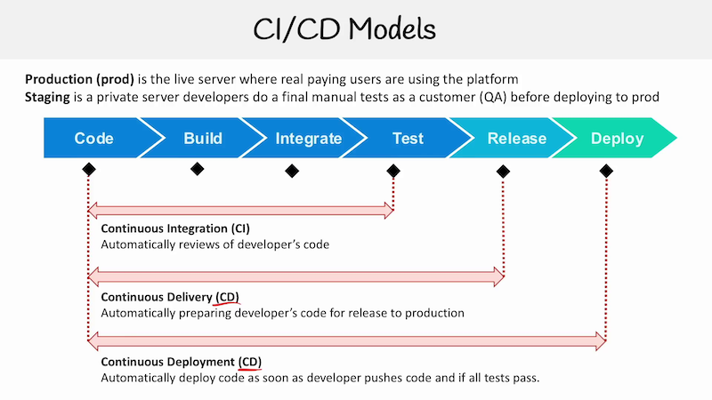

# AWS Developer Associate: CI/CD overview

## freeCodeCamp ExamPro walkthrough

[Video 1](https://youtu.be/RrKRN9zRBWs) 10.50.00

### CI and CD definitions

- Continuous Integration (CI): automated testing of code
- Continuous Delivery (CD): automated release prep
- Continuous Deployment (CD): automated deployment of code to servers
