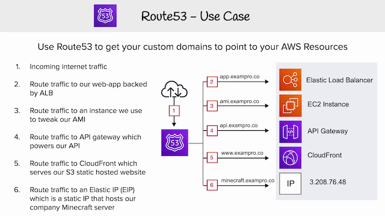

# AWS Developer Associate: Route53

## freeCodeCamp ExamPro walkthrough

[Video 1](https://youtu.be/RrKRN9zRBWs)

- Use case: exampro.co

  

- **Record sets** allow us to point to domain and subdomain.
- Alias target: always points to the same resource (S3 website etc) even when IPs change
- **Traffic Flow** is a visual route editor.
- **Routing policies:**
  1. simple: 1 record, can have ≥1 IP, traffic distributed randomly among IPs
  2. weighted: can assign weights to distribute traffic to servers
  3. latency: direct traffic for lowest latency for end user
  4. geolocation: based on location instead of latency
  5. geoproximity: delineate regions, must use Traffic Flow not record sets
  6. failover: can set a secondary recovery site
  7. multi-value answer policies use health checks before responding to DNS queries
- **Health checks**
- Route53 resolver (formerly .2 resolver) can resolve environments that are mixed between on-premise and on-cloud.
